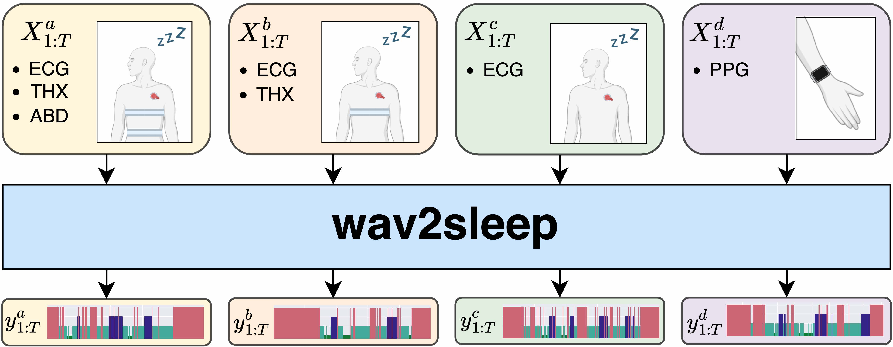
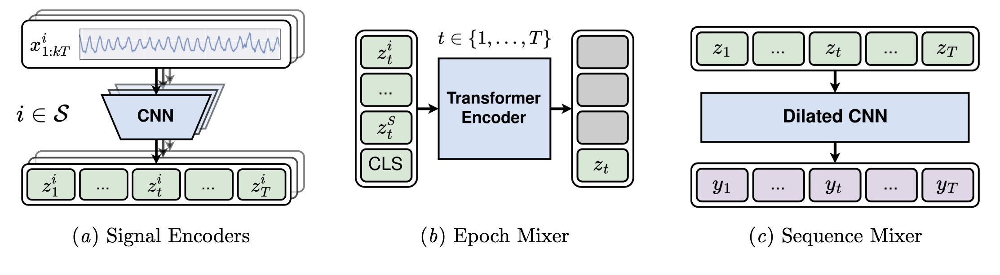
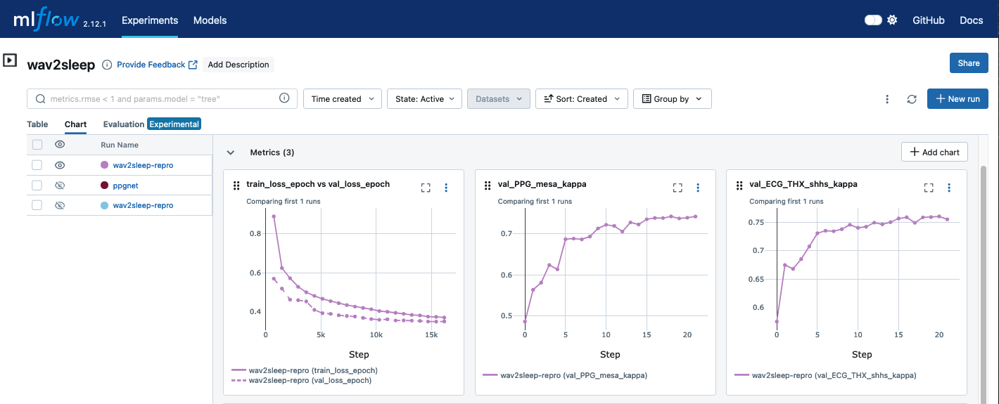

<div align="center">
  <h2><b>wav2sleep 💤: A Unified Multi-Modal Approach to Sleep Stage Classification from Physiological Signals
  </b></h2>
</div>



## Overview

This repository contains the official implemententation of **wav2sleep**💤, which has been accepted to **[Machine Learning for Health (ML4H) 2024](https://ahli.cc/ml4h/)**.

wav2sleep is a unified model for sleep staging from sets of cardio-respiratory (🫀/🫁) signals. It can be jointly trained across heterogeneous datasets, where the availability of input signals can vary. At test-time, the model can be applied to *any* subset of the modalities used during training.

After jointly training on over 10,000 overnight recordings from six publicly available polysomnography datasets, including SHHS and MESA, wav2sleep outperforms existing sleep stage classification models across a range of test-time modality combinations, including the electrocardiogram (ECG), photoplethysmogram (PPG), and abdominal (ABD) and thoracic (THX) respiratory signals.

To find out more, check out our paper: https://arxiv.org/abs/2411.04644

<a href="https://arxiv.org/abs/2411.04644"></a>

## Features 🔥
### Models
Implementation of `Wav2Sleep` and baseline models in PyTorch, using [Lightning](https://lightning.ai/) for training.


*Figure: wav2sleep architecture for sets of signals.*

### High-performance data processing pipelines
Scripts for transforming EDF files and sleep stage annotations from all 7 datasets used into efficient, columnar parquet files for model training. This can be parallelised over multiple CPU cores or an entire cluster using [Ray](https://www.anyscale.com/ray-open-source), e.g.:
```bash
python preprocessing/1_ingest.py --folder /path/to/shhs --output-folder /path/to/processed/datasets --max-parallel 16
```

## Table of Contents
1. [Set-up and Installation](#set-up-and-installation)
2. [Training and Evaluation](#training-and-evaluation)
4. [Visualising Results](#visualising-results)
5. [Citation](#citation)
6. [License](#license)

## Set-up and Installation
### a. Environment
First clone the repository and install the Conda environment with:
```bash
git clone https://github.com/joncarter1/wav2sleep
cd wav2sleep
conda env create --file environment/conda.yaml
pip install -e .
gem install nsrr --no-document # For downloading NSRR datasets
```

### b. Datasets
Our work uses datasets managed by the National Sleep Research Resource ([NSRR](https://sleepdata.org/)). To reproduce our results, you will need to apply for access to the following datasets:
- SHHS
- MESA
- WSC
- CCSHS
- CFS
- CHAT
- MROS

Once approved, these can be downloaded with the NSRR Ruby gem, e.g. `nsrr download shhs`. More details can be found on the NSRR website.

Once downloaded, we provide high-performance processing scripts to process each dataset and split it into training, validation and test partitions. Instructions on how to do this can be found [here](preprocessing/README.md).

## Training and Evaluation
To train and evaluate the model on all datasets, just run:
```bash
python train.py model=wav2sleep num_gpus=1 tune_batch_size=True target_batch_size=16 name=wav2sleep-repro inputs=all datasets=all test=True
```
This will find the largest batch size that fits on your GPU, and accumulate batches for an effective batch size of at least 16. If you're lucky enough to have more than one GPU, you can specify e.g. `num_gpus=2` to run across them using distributed data parallel (DDP) training.

## Visualising Results

We use [MLFlow](https://mlflow.org) to log trained models and evaluation metrics. By default, these will be stored in a local directory (`./mlruns`) and can be visualized results by running:
```bash
mlflow server
```
and visiting http://localhost:5000 in your browser:


*Figure: Screenshot from an MLFlow dashboard*

## Citation

If you find this code useful for your research, please cite our paper:

```bibtex
@misc{carter2024wav2sleepunifiedmultimodalapproach,
      title={wav2sleep: A Unified Multi-Modal Approach to Sleep Stage Classification from Physiological Signals},
      author={Jonathan F. Carter and Lionel Tarassenko},
      year={2024},
      eprint={2411.04644},
      archivePrefix={arXiv},
      primaryClass={cs.LG},
      url={https://arxiv.org/abs/2411.04644},
}
```

## License

Copyright © 2024, Jonathan Carter.

## Credits
This project was created with [Cookiecutter](https://github.com/audreyr/cookiecutter) and the [joncarter1/cookiecutter_research](https://github.com/joncarter1/cookiecutter_research) template.
